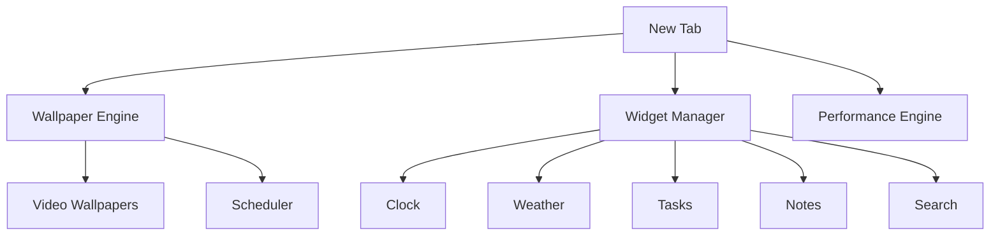

<div align="center">

# 🌌 LiveScape Pro

### Your Browser. Reimagined.

Transform every new tab into a cinematic experience with live wallpapers, smart widgets, beautiful glassmorphism, and a workspace designed for focus.

<br>


<br>

### 🎥 Live Wallpapers • 🌤 Weather • 📝 Notes • ✅ Tasks • ⏰ Scheduler • ⚡ Performance Engine

<br>

> Open a tab. Enter a world.

<br>


</div>

---

# ✨ Experience

LiveScape Pro isn't another new-tab extension.

It's a personalized dashboard where productivity meets aesthetics.

Imagine opening a new tab and seeing:

🌌 Animated live wallpapers

🕒 Beautiful clock widgets

🌤 Real-time weather

📝 Instant notes

✅ Daily tasks

🔍 Smart search

🎨 Fully customizable layouts

All running directly inside Chrome.

---

# 🎬 Preview

<div align="center">

| Dashboard                      | Widgets                      |
| ------------------------------ | ---------------------------- |
|  |  |

| Scheduler                      | Wallpaper Gallery            |
| ------------------------------ | ---------------------------- |
|  |  |

</div>

---

# 🚀 Features

## 🎥 Cinematic Wallpaper Engine

Bring your browser to life.

* Video Wallpapers
* Animated Backgrounds
* Custom Uploads
* Auto Persistence
* Smart Scheduling
* Smooth Playback

---

## 🧩 Productivity Widgets

<table>
<tr>
<td>🕒 Clock</td>
<td>🌤 Weather</td>
<td>📝 Notes</td>
</tr>

<tr>
<td>✅ Tasks</td>
<td>🔍 Search</td>
<td>🔗 Quick Access</td>
</tr>
</table>

---

## 🎨 Personalization

Create your own workspace.

* Resize Widgets
* Move Widgets
* Change Opacity
* Theme Switching
* Widget Locking
* Custom Wallpapers

---

## ⚡ Performance Engine

Built for both low-end and high-end systems.

```yaml
Low Power Mode:
  FPS: 12
  GPU Usage: Minimal

Balanced Mode:
  FPS: 24
  GPU Usage: Optimized

High Performance:
  FPS: 30
  Maximum Visual Quality
```

---

# 🏗 Architecture



---

# 📦 Installation

```bash
git clone https://github.com/kirankumar34/LiveScape-Lively-Wallpaper.git
```

```text
chrome://extensions
```

✔ Enable Developer Mode

✔ Load Unpacked

✔ Select Project Folder

✔ Open New Tab

---

# 🔒 Privacy

LiveScape Pro respects your privacy.

### We Never

❌ Track Browsing Activity

❌ Collect Personal Information

❌ Sell User Data

❌ Share Information

### We Only Store

✔ Wallpapers

✔ Widget Layouts

✔ Notes

✔ Tasks

Stored locally inside your browser.

---

# 🛣 Roadmap

### Current

* [x] Live Wallpapers
* [x] Weather Widget
* [x] Notes Widget
* [x] Task Manager
* [x] Wallpaper Scheduler

### Upcoming

* [ ] Music Widget
* [ ] Wallpaper Marketplace
* [ ] Widget Presets
* [ ] Cloud Sync
* [ ] Community Themes

---

# ⭐ Support

If you enjoy LiveScape Pro:

⭐ Star the repository

🍴 Fork the project

🚀 Share it with others

---

<div align="center">

## 🌌 LiveScape Pro

### Make Every New Tab Feel Alive.

Built by Kiran Kumar

</div>
